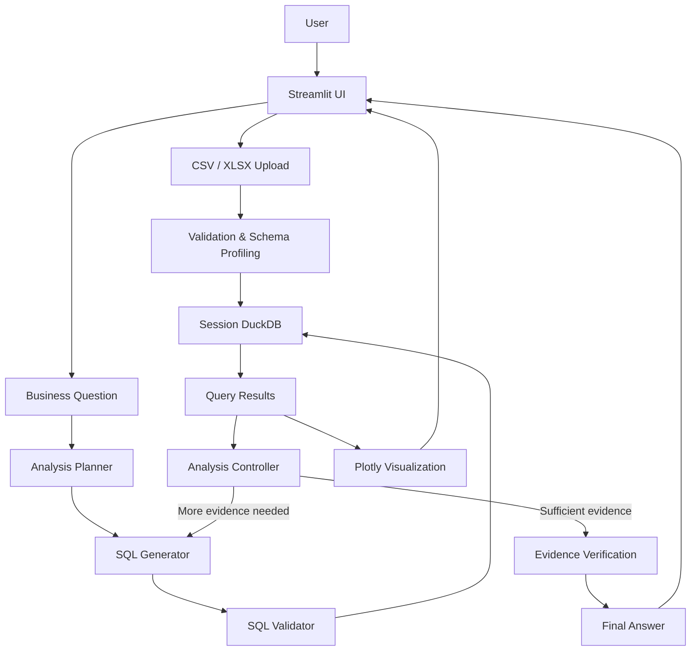

# Business Analytics Copilot

An agentic natural-language analytics system that converts business questions into validated SQL, performs bounded multi-step analysis over structured data, and returns evidence-backed insights with visualizations.

**Python · DuckDB · OpenRouter · Streamlit · Plotly**

## Overview

Business questions often require identifying the right tables, writing SQL, joining data, calculating metrics, comparing trends, and investigating possible drivers of change. This makes even straightforward analysis dependent on both technical and business knowledge.

**Business Analytics Copilot** provides a natural-language interface for this workflow. Users upload CSV or XLSX business data and ask questions in plain English. The system plans the analysis, generates and validates read-only SQL, executes it against DuckDB, performs additional analysis when needed, and returns an evidence-backed answer with supporting data and visualizations.

## Example

**Question**

> Why did profit decline in Q3?

**Workflow**

```text
Business Question
       ↓
Analysis Planning
       ↓
SQL Generation
       ↓
SQL Validation
       ↓
DuckDB Execution
       ↓
Follow-up Analysis
       ↓
Evidence Verification
       ↓
Answer + Supporting Data + Visualization
```

Simple questions can be answered with a single query, while more complex questions can trigger bounded multi-step investigation.

## Key Features

* Natural-language business question answering
* Schema-aware SQL generation
* DuckDB-based analytical execution
* Read-only SQL validation and safeguards
* Bounded multi-step agentic analysis
* Follow-up query generation
* Evidence-grounded answer generation
* CSV/XLSX data upload
* Automatic Plotly visualizations
* SQL and analysis-trace transparency
* Deterministic evaluation benchmark

## Architecture



### Data Layer

```text
CSV/XLSX
   ↓
Validation
   ↓
Schema Profiling
   ↓
DuckDB
```

### Analytics Layer

```text
Question
   ↓
Planner
   ↓
SQL Generator
   ↓
SQL Validator
   ↓
DuckDB
   ↓
Analysis Controller
   ↓
Follow-up Queries
   ↓
Evidence Verification
```

### Presentation Layer

```text
Final Answer
+
Supporting Results
+
Visualization
+
SQL / Analysis Trace
```

See [`docs/architecture.md`](docs/architecture.md) for detailed component responsibilities.

## Agentic Workflow

The system goes beyond basic text-to-SQL.

For a simple question:

```text
Question → SQL → Result
```

For a question such as:

> Why did profit decline in Q3?

the system can perform a sequence of analyses:

```text
1. Compare profit across periods
2. Analyze the change by region
3. Analyze the change by product category
4. Synthesize the available evidence
```

Execution is bounded by a maximum number of analysis steps to prevent uncontrolled querying.

## Tech Stack

| Component           | Technology                                     |
| ------------------- | ---------------------------------------------- |
| Language            | Python                                         |
| Data Processing     | Pandas                                         |
| Analytical Database | DuckDB                                         |
| LLM Provider        | OpenRouter                                     |
| Model               | Configurable hosted free model                 |
| Interface           | Streamlit                                      |
| Visualization       | Plotly                                         |
| Configuration       | python-dotenv                                  |
| SQL Validation      | Custom read-only validation with DuckDB checks |
| Testing             | Python `unittest`                              |

## Sample Dataset

The repository includes a reproducible synthetic business dataset containing:

* `orders`
* `customers`
* `products`
* `targets`

Core relationships:

```text
orders.customer_id → customers.customer_id
orders.product_id  → products.product_id
```

The dataset supports revenue, profit, regional, product, customer-segment, trend, and target-versus-actual analysis.

## Project Structure

```text
Business-Analytics-Copilot/
│
├── app.py
├── src/
│   ├── analytics/
│   ├── database/
│   ├── data/
│   ├── llm/
│   ├── ui/
│   └── utils/
│
├── data/
│   └── sample/
│
├── evaluation/
├── tests/
├── scripts/
├── docs/
│
├── requirements.txt
├── .env.example
├── .gitignore
└── README.md
```

## Getting Started

### 1. Clone the repository

```powershell
git clone <repository-url>
cd Business-Analytics-Copilot
```

### 2. Create a virtual environment

```powershell
py -m venv .venv
```

Activate it in PowerShell:

```powershell
.venv\Scripts\Activate.ps1
```

### 3. Install dependencies

```powershell
pip install -r requirements.txt
```

### 4. Configure OpenRouter

Create a `.env` file from `.env.example` and set:

```dotenv
OPENROUTER_API_KEY=
OPENROUTER_MODEL=openrouter/free
OPENROUTER_BASE_URL=https://openrouter.ai/api/v1
```

The project uses a hosted model through OpenRouter; no model weights are downloaded locally.

Never commit `.env` or expose API credentials in source files.

### 5. Generate sample data

```powershell
python scripts/generate_sample_data.py
```

### 6. Run the application

```powershell
streamlit run app.py
```

Open the local Streamlit URL, upload the sample data, and ask a business question.

## Usage

1. Upload one or more CSV/XLSX files.
2. Load the data into the current session.
3. Inspect tables, schemas, and sample rows.
4. Ask a business question.
5. Review the generated answer, supporting data, visualization, SQL, and analysis trace.

### Example Questions

```text
Which region generated the highest revenue?

Which product category generates the highest revenue?

Which customer segment generates the most revenue?

Which regions missed their revenue target?

Why did profit decline in Q3?
```

See [`docs/demo.md`](docs/demo.md) for a complete walkthrough.

## Evaluation

The project includes a deterministic benchmark containing **27 business questions**:

* 22 answerable questions
* 5 intentionally unsupported questions

The latest recorded deterministic evaluation produced:

| Metric                        | Result |
| ----------------------------- | -----: |
| Answerable SQL executions     |  22/22 |
| Matching result sets          |  22/22 |
| Evidence checks               |  22/22 |
| Unsupported-question handling |    5/5 |
| Multi-step analyses           |    3/3 |

These results are based on controlled deterministic fixtures and **do not represent live hosted-model accuracy or production latency**.

The evaluation framework also covers malformed outputs, invalid SQL, unknown columns, failed follow-up queries, API errors, and other failure cases.

See [`evaluation/README.md`](evaluation/README.md) for the methodology and detailed results.

## Reliability and Guardrails

The system includes:

* schema-aware SQL generation
* read-only SQL validation
* bounded agent execution
* controlled chart generation
* evidence checks for numerical claims
* conservative fallbacks when the available evidence is insufficient

Model-generated Python or chart code is never executed directly.

## Limitations

* The included business data is synthetic.
* Free hosted models can be subject to rate limits and availability changes.
* LLM output can vary across requests.
* Root-cause analysis identifies evidence-supported contributors rather than proving causal relationships.
* The automated benchmark evaluates pipeline correctness more strongly than open-ended semantic quality.
* Session data is intended for analysis within the current application session rather than durable storage.

## Documentation

* [`Architecture`](docs/architecture.md)
* [`Demo Guide`](docs/demo.md)
* [`Evaluation Guide`](evaluation/README.md)

## Possible Extensions

* richer and larger business datasets
* stronger semantic evaluation of natural-language answers
* support for additional LLM providers and model routing

## Project Status

The core portfolio implementation is complete:

```text
✅ Data Foundation
✅ Natural Language → SQL
✅ Agentic Analysis
✅ Streamlit Application
✅ Visualization
✅ Evaluation & Reliability
✅ Documentation
```
